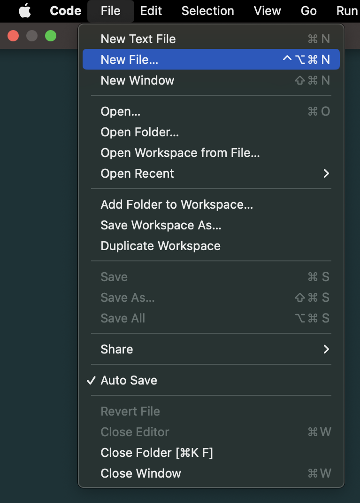
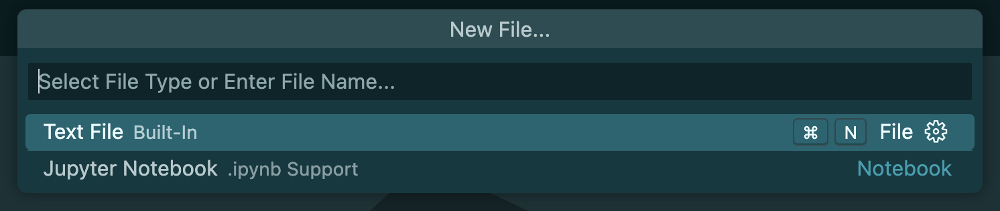
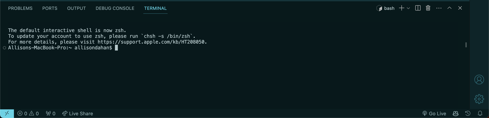
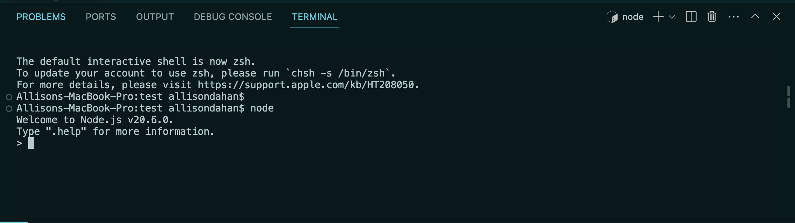

# Set Up

## **Overview**

In this section, you will learn how to set up and run a new JavaScript file on Visual Studio Code (VSCode). The method for setting up differs for each programming language. JavaScript, being the primary programming language you'll encounter in your first term as Full Stack Web Development (FSWD) students, requires specific steps to ensure a smooth development experience.

## **Installation & Set Up**

Before diving into coding, ensure you have the necessary tools installed:

- Download and install the latest version of Visual Studio Code that is compatible with your operating system from https://code.visualstudio.com/.

- Install the latest LTS(Long Term Support) version from https://nodejs.org/.

Node.js is a runtime environment that allows you to run JavaScript code outside of a browser, essential for testing and running your JavaScript projects.

## Creating a New File

In VSCode, there are multiple methods to create new files and folders, making it flexible for developers to organize their projects. I recommend using Method 1 first since it is the most common method.

The figure above will help to visualize the areas where you can create a new file.

### **Method 1: Using the Menu Bar**

1. In your menu bar, go to File > New File.

It will direct you to the command palette. 

2. Enter your filename with a `.js` extension, indicating it's a JavaScript file. For example, `example.js`.

3. A file explorer window will pop up, save your file in the desired location.

---

### **Method 2: Using the Command Palette**

1. Open the Command Palette: Press F1 or Ctrl+Shift+P (Windows/Linux) or Cmd+Shift+P (Mac).

2. Type `> File: New File` and press `Enter`.

3. Save the file (For PC,`Ctrl+S` or Mac,`Cmd+S`) in your desired location, specifying the name and extension.

---

## **After Setting Up a New File**

Now that you have created a new JavaScript file, you can write your JavaScript code.

1. Type your JavaScript code into this new file. For this example, use `console.log("Hello World");` to test that everything is working.

1. Open the Terminal. Use the shortcut `Ctrl+ J` (Windows/Linux) or `Cmd+ J` (Mac), or navigate through the menu View > Terminal.

2. Type `node <filename.js>` to execute your JavaScript file. Replace `<filename.js>` with the name of your file.

If successful, the terminal should return an output of: `Hello World`.

By following these steps, you will have a working setup for developing and running JavaScript files in Visual Studio Code. This setup is crucial for your development work in the Full Stack Web Development program, providing you with the tools and knowledge to efficiently write, test, and debug your code.

### Node REPL

The Node.js REPL(Read-Evaluate-Print Loop) is an interactive environment that allows you to run JavaScript code without having to write an application. Entering this environment is useful for debugging, testing or experimenting with JavaScript code.

#### Enter/Exit Node REPL

To enter this environment:

1. Run the command: `node` in your terminal.
2. Test out whatever JavaScript code you would like.

To exit this environment, there are two methods:

**Method 1:** Using Commands

1. Enter `.exit` in your terminal.

**Method 2:** Using keyboard shortcuts

- Entering `Ctrl + C` once, will terminate the current command.
- Entering `Ctrl + C` twice, will exit the REPL if a current command isn't running.
- Entering `Ctrl + D`, will exit the REPL.

### Using the Terminal

The terminal, also known as console or command line, enables users to interact with your computer's operating system through text commands. It's important for file management, installing packages and executing scripts.

#### Basic Terminal Commands

Familiarize yourself with basic terminal commands to navigate and manage your projects:

- `pwd` (Print Working Directory): Displays the current directory path
- `ls` (List): Lists all files and directories in the current directory
- `cd <directory>` (Change Directory): Moves the terminal's focus to another directory. Replace `<directory>` with the path to the target directory.
- `mkdir <directory name>` (Make Directory): Creates a new directory.
- `touch <file_name>` (Touch): Creates a new file if it doesn't exist
