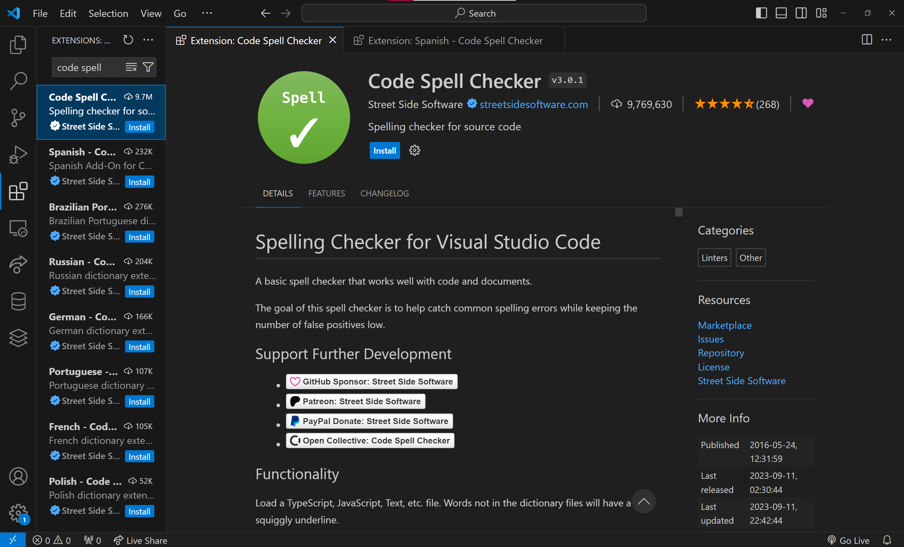

# Extensions Marketplace

## **Overview**

Extensions can enhance the performance of Visual Studio Code (VS Code). By using extensions in addition to the built-in features of VS Code, you can install languages, themes, debuggers, and tools to assist in your code development. This document explains how to find, install, and manage VS Code extensions.

## **How to getting extensions**

### Step 1. Open vscode

Launch the Visual Studio Code (VS Code) application on your computer.

### Step 2. Access extension marketplace

There are 3 different ways to access to extension marketplace.

**Option 1**  
Using the Activity Bar  
Look for the extension icon on the **activity bar** located on the left side of the VS Code window.  
Click on the extension icon.

**Option 2**  
Using the Menu Bar  
Alternatively, navigate to the Menu bar of VS Code.  
Click on the **View** menu.  
Select the "Extensions" tab from the dropdown menu.

**Option 3**  
Using Shortcut Keys  
Use the shortcut keys based on your operating system:  
Windows/Linux: Press **Ctrl+Shift+X**  
Mac: Press **Command+Shift+X**

### Step 3. Search the extension

Once you've accessed the Extension Marketplace, you'll find a search bar.  
Type the name or keywords related to the extension you are looking for and press Enter.

### Step 4. Select Extension33

Browse through the search results and select the extension that best fits your requirements.  
For example, if you're a first-year student, you might choose the "Git Graph" extension for GitHub integration or "Code Spell Check" for improving your code assignments.

### Step 5. Install the Extension

On the extension page, click the **Install** button to initiate the installation process.  
 Wait for the installation to complete.

### Step 6. Verify installation

Once the installation is finished, you can verify by checking the list of installed extensions. Click on the Extensions icon in the Activity Bar (or use the shortcut Ctrl+Shift+X) to see the installed extensions.

### Step 7. Update extensions (if needed)

Periodically, it's essential to keep your extensions up-to-date for improved functionality and security.  
To update extensions:  
Navigate to the Extensions view (Ctrl+Shift+X).  
Look for the **Update** button next to each extension that has
