# Themes & Customization

## VSCode Themes

<!-- some primer instructions here -->

1. Click “Manage”  
<figure markdown="span">
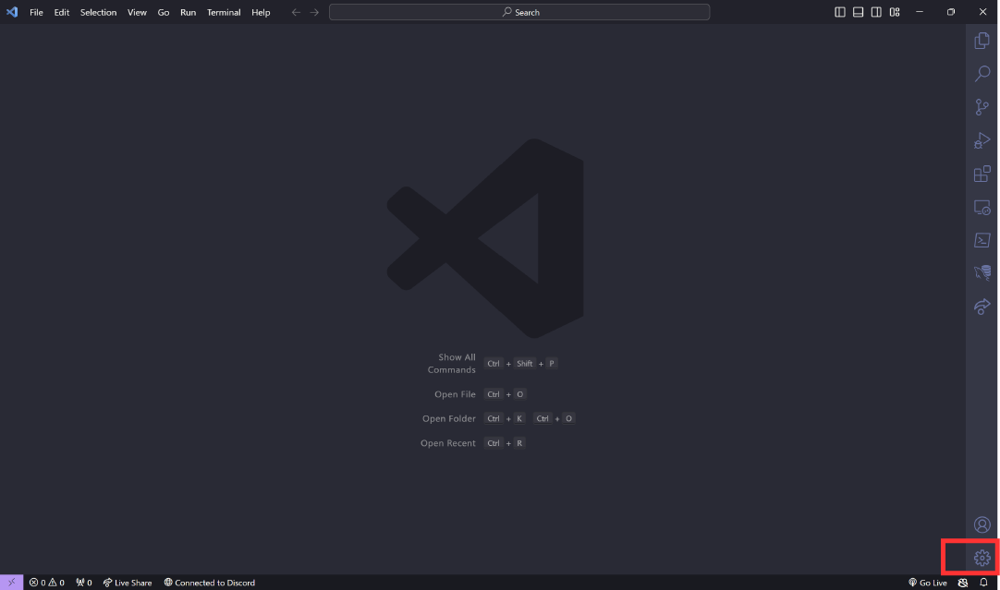{ max-width="500" }
</figure>

2. Hover “Themes"  
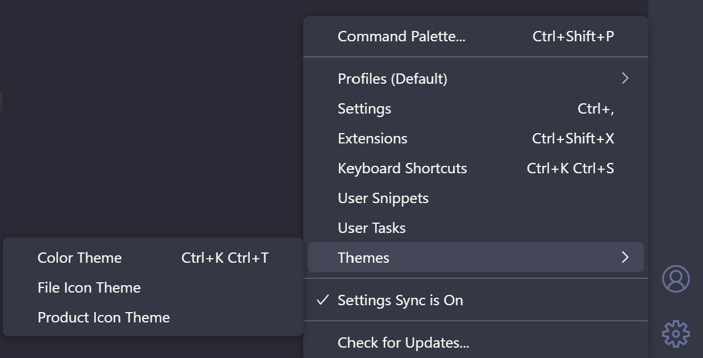

3. Click “Color Themes”  
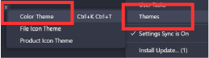

4. Command center displays “Select color themes”, list of themes below it  
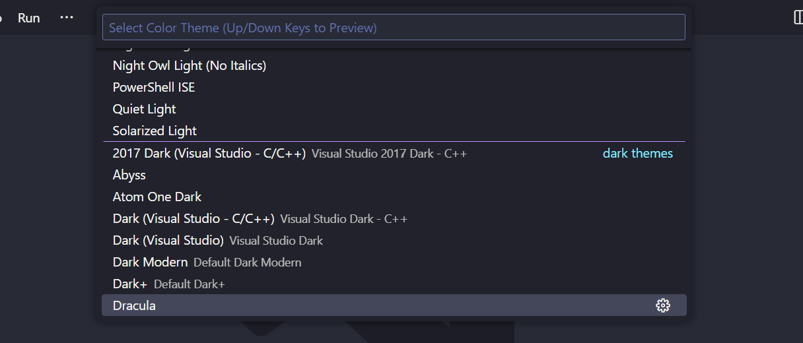

5. If you navigate through themes with the arrow keys, VSCode will show what that theme will look like if you select that theme.  
    a. If you use the mouse to select a theme, then VSCode will not show a preview.  

6. Hit “Enter” or use the mouse to click a theme to select it.

7. If you would like to select a theme that is not shown on the list, you can select “+ Browse Additional Color Themes…”. You may have to 
navigate to the top of the menu, by arrow keys or the scroll wheel, to view this option.
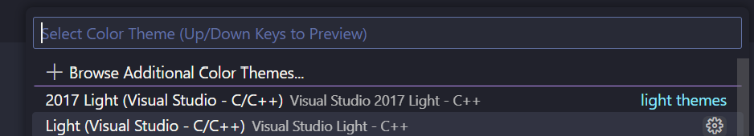

8. From here, you can type in the search bar if you know the name of the theme you want, or you can scroll vertically through the dropdown menu to browse themes  
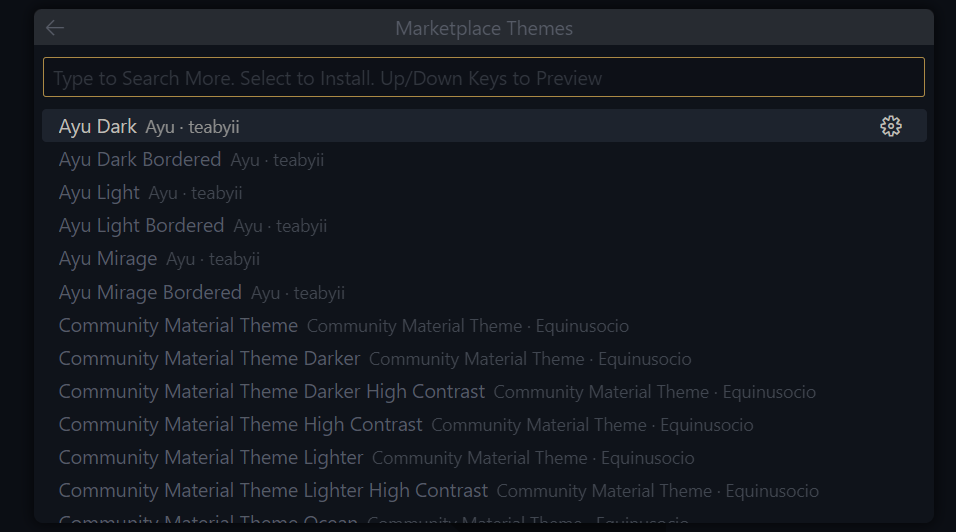

9. As before, if you navigate through themes with the arrow keys, VSCode will show what that theme will look like if you select that theme, and will not preview if you use the mouse.

10. Hit “Enter” or click on a theme name to select it.

## Changing the Layout of VSCode

The easiest way to change the layout of VSCode at once it by using the "Customize Layout..." button.
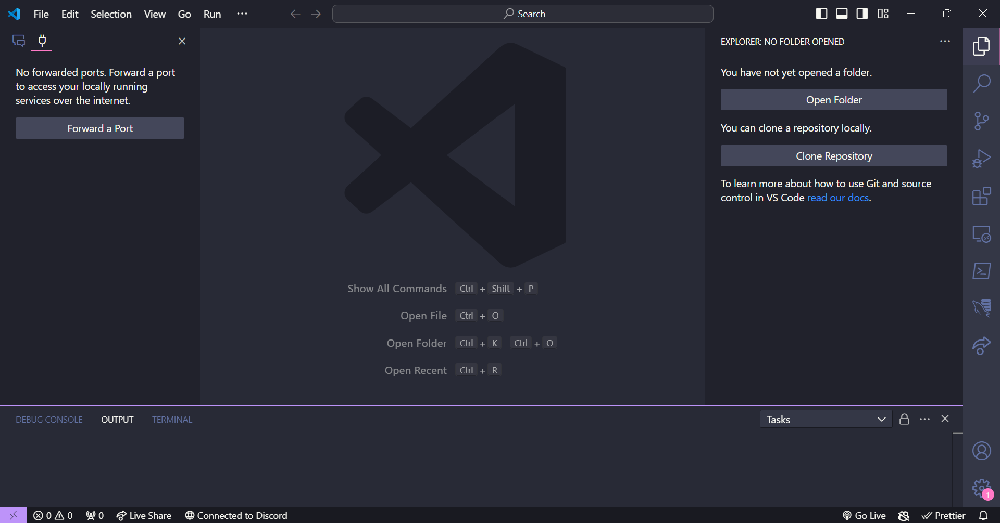  

1. Click the "Customize Layout..." button at the top right of the window.
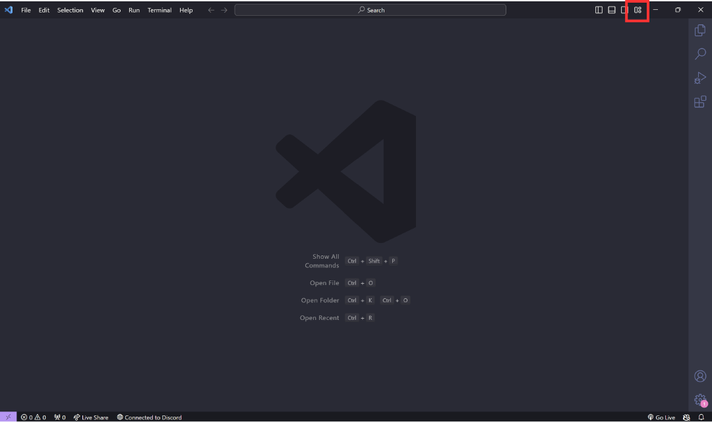  

2. A dropdown menu will appear below the command center. There will be options to change the *visibility* of window elements, the *position* of the Primary Side Bar, the *alignment* of the window panels and what *mode* the VSCode window is in. You can navigate this menu by clicking on the option you would like.
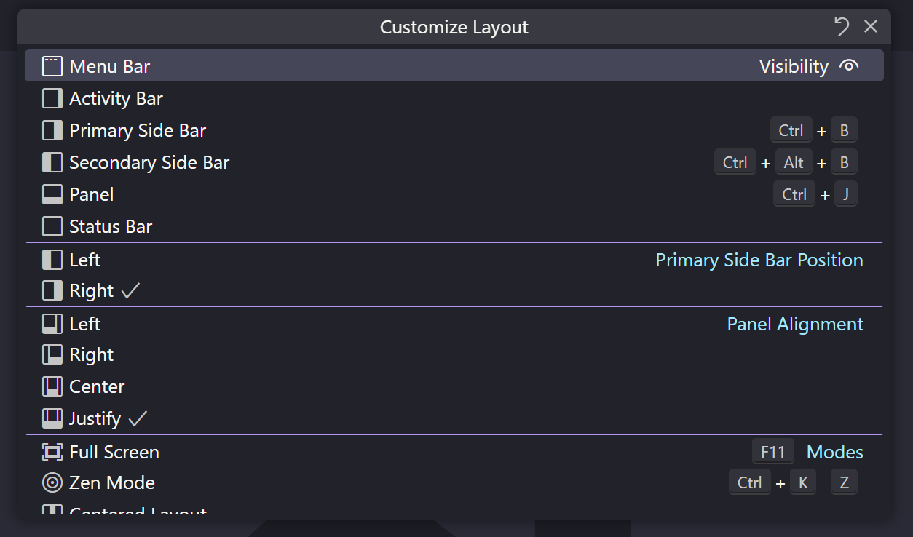  

### Visibility

Selecting an element in this menu will toggle whether the element is open in the window. The visibility status of the element is indicated by the eye symbol to the right of the element in this menu. 

### The Primary Side Bar
By default, the Primary Side bar is located on the left side of the window.

**Option 1**  
    1. If you would like to move the side bar from the "Customize Layout" dropdown menu, click "Left" or "Right' to place the side bar on the left or right side of the window, respectively. 

**Option 2**  
    1. Alternatively, you can right-click the Activity bar.

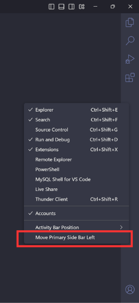  

    2. A drop down menu will open, navigate to the bottom of the menu and select "Move Primary Side Bar Right".

### VSCode View Modes

There are 3 options to change the how VSCode is viewed: **Full Screen**, **Zen Mode** and **Centered Layout**.

#### Full Screen

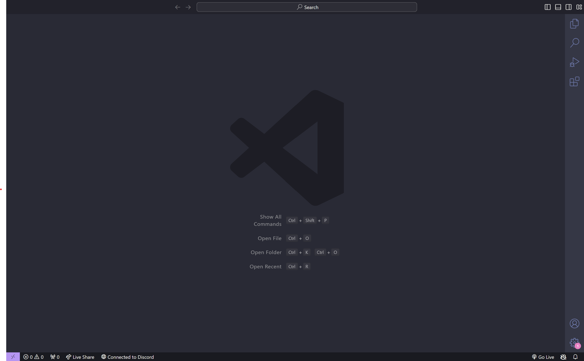  

Removes the border of the VSCode window and makes it take up the entirety of the device screen. 

#### Zen Mode

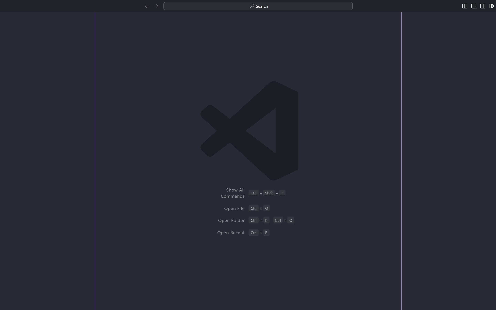  

Hides all elements of VSCode except for the editor. It also centers the editor in the middle of the window. 

#### Centered Layout

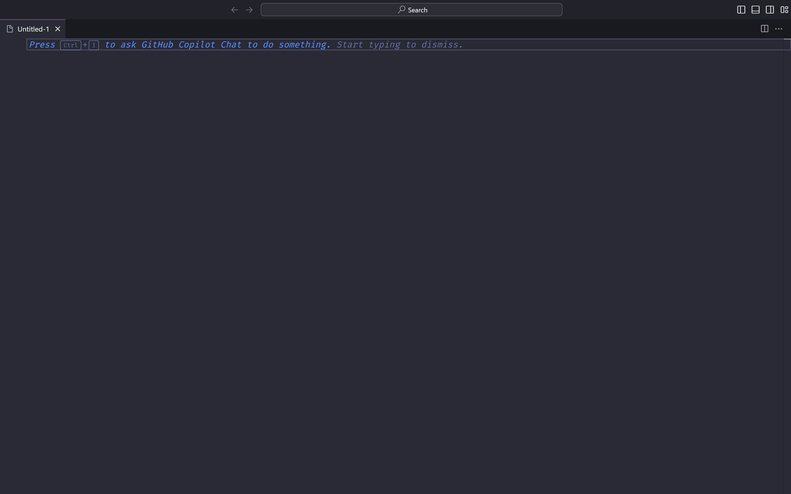  

Centers the editor. Does not remove the window border.

# Glossary
<!-- Will add this to main glossary later -->
## Theme

:   The combination of colours used to customize VSCode's environment and interface.

## Workbench

:   The overall element that contains all aspects of the VSCode window. Specifically contains the Menu Bar, Activity bar, Primary and Secondary Side Bars, Panel, Status Bar, Editor and Title.

## Command center

:   The top and centermost bar in the VSCode window. Contains the Workspace name.

## Window Elements

: Components of the VSCode window that contain areas of information that a user might need. Able to be made visible, hidden and moved.