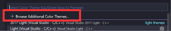

# Themes & Customization

## VSCode Themes

<!-- some primer instructions here -->

1. Click “Manage”  
<figure markdown="span">
{ max-width="500" }
</figure>

2. Hover “Themes"  

3. Click “Color Themes”  

4. Command center displays “Select color themes”, list of themes below it  

5. If you navigate through themes with the arrow keys, VSCode will show what that theme will look like if you select that theme.  
    a. If you use the mouse to select a theme, then VSCode will not show a preview.  

6. Hit “Enter” or use the mouse to click a theme to select it.

7. If you would like to select a theme that is not shown on the list, you can select “+ Browse Additional Color Themes…”. You may have to 
navigate to the top of the menu, by arrow keys or the scroll wheel, to view this option.

8. From here, you can type in the search bar if you know the name of the theme you want, or you can scroll vertically through the dropdown menu to browse themes  

9. As before, if you navigate through themes with the arrow keys, VSCode will show what that theme will look like if you select that theme, and will not preview if you use the mouse.

10. Hit “Enter” or click on a theme name to select it.

## Changing the Layout of VSCode
*blerb about how you might want to customize your user experience*  
  

### The Menu Bar
...

### The Activity Bar
...

### The Primary Side Bar
...

### The Secondary Side Bar
...

# Glossary
<!-- Will add this to main glossary later -->
## Theme

:   Definition

## Command center

:   Definition

## Workbench

:   Definition