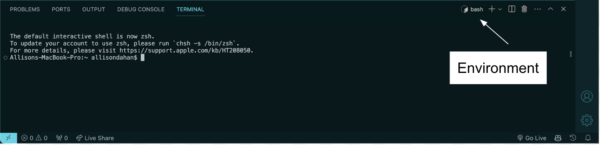

# Troubleshooting

## Issue #1: File Not Found

**Symptom:** You try to run a JavaScript file, the terminal returns "File not found" error.

**Possible Cause:** Your terminal is not in the same directory as the JavaScript file you're trying to run.

**How to Fix:**

1.  Use `cd` command in the terminal to navigate to the same directory as your file.
2.  Use `ls` command in the terminal and check that your JavaScript file is listed to verify you're in the right location.

## Issue #2: Command's Not Working

VSCode's terminal can use different shells (e.g., Bash, Zsh, PowerShell). Ensure you're using one compatible with the commands provided (Bash, Zsh, or PowerShell are recommended). You can switch the shell by clicking on the dropdown menu in the terminal's toolbar and selecting your preferred shell.

**Symptom:** You attempt to run your JavaScript file using Node.js commands. The terminal says "Command not found", even though Node is installed.

**Possible Cause:** Your terminal is in an environment that isn't compatible with Node.js commands. For example, Node.js commands aren't compatible with the Python virtual environment.

**How to Fix:**

1. Open terminal
2. Run the command: `exit`. This will exit most environments.
3. Restart Visual Studio Code.

## Issue #3: Live Share being unresponsive

**Symptom:** Nothing happens when you click the "Share" and "Join" buttons.

**Possible Cause:** Internal bugs with the Live Share software

**How to Fix:**

1.  Run the command > Live Share: Repair Installation in the command terminal.

## Issue #4: VS Code extensions stopped working

**Symptom:** No extensions are working

**Possible Cause:** Pc shut down with VS Code open

**How to Fix:**

1. Open terminal
2. Run: `Disable All Extension`
3. Then run: `Enable All Extensions`
4. Restart Visual Studio Code
